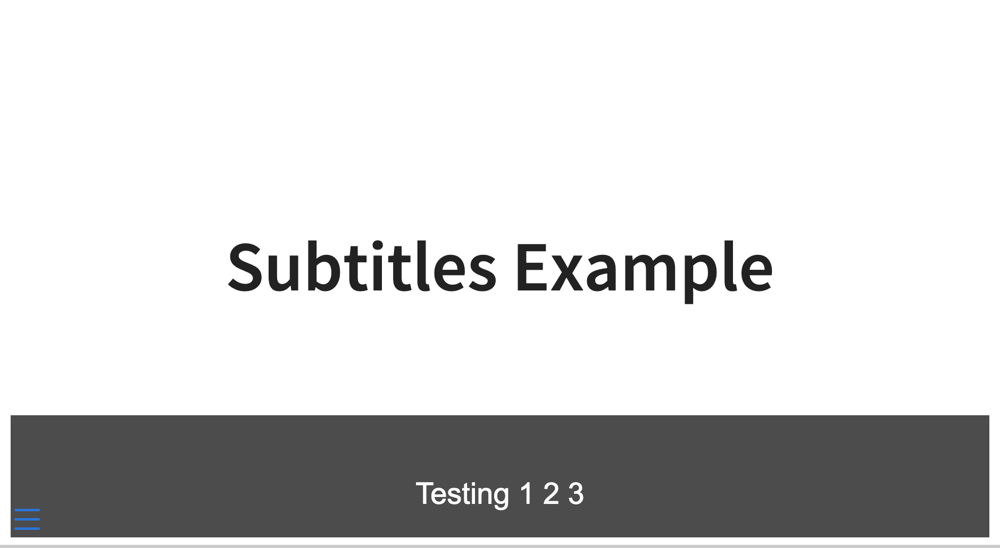

# Subtitles Extension For Quarto

Adds subtitles to RevealJS for Quarto. This project ports the [jasonwebb/revealjs-subtitles](https://github.com/jasonwebb/revealjs-subtitles) plugin over to Quarto. Credit goes to [Jason Webb](https://github.com/jasonwebb) for the original plugin.

Here's an example of what this extension look likes. Subtitles are added in real-time as you speak in a grey box at the bottom of the slide.



## Installing

```bash
quarto add parmsam/quarto-subtitles
```

This will install the extension under the `_extensions` subdirectory.
If you're using version control, you will want to check in this directory.

## Using

Simply add the extension to the list of revealjs plugins like:

```yaml
title: My Presentation
format:
    revealjs: default
revealjs-plugins:
  - subtitles
```

Ensure that you are using a browser like Chrome or Safari where speech recognition interfaces are supported. Then you'll need to ensure your microphone is enabled and you have given the browser permission to use it for the presentation.

By default, you can toggle subtitles on and off by pressing the `t` key.

You can change these settings in your YAML header like this:

```yaml
title: My Presentation
format:
    revealjs:
    subtitles:
        toggleKey: 's'
        isVisible: true
revealjs-plugins:
    - subtitles
```

You can download the subtitles as a text file by adding an HTML button with the `subtitles-dl-btn` class to any slide. Clicking on the button will download a text file with the subtitles so far for the entire presentation.

```html
<button type="button" class="subtitles-dl-btn">Download Subtitles</button>
```

## Example

Here is the source code for a minimal example: [example.qmd](example.qmd).

## Disclaimer

Please note that the specific modifications from the third-party repository were not explicitly licensed. Use of this code is under the assumption that it adheres to the MIT License, since Reveal.js is licensed under the MIT License.
